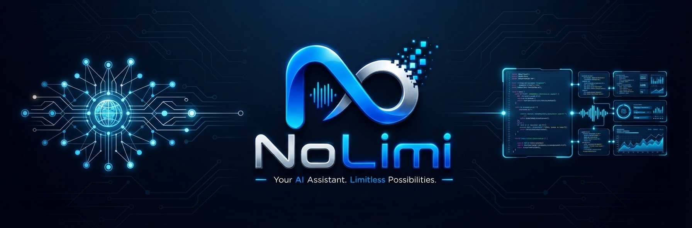
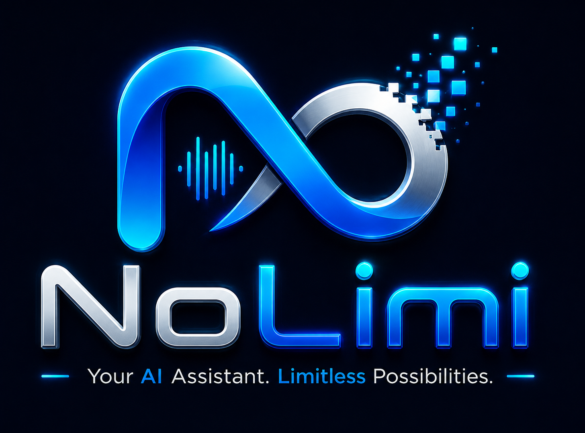

<p align="center">
  
</p>

<p align="center">
  
</p>

<h1 align="center"> By @kunal_chwdry</h1>

<p align="center">
An AI-powered virtual assistant built with Python.
<br>
<strong>Intelligence Without Limits.</strong>
</p>

<p align="center">
  
  
  
  
</p>

---

# 🚀 About

NoLimi is an AI-powered virtual assistant built with Python. It is designed to automate daily tasks using voice commands and artificial intelligence.

The long-term vision of NoLimi is to combine Artificial Intelligence, Automation, and Cybersecurity into one intelligent assistant.

---

# ✨ Current Features

- 🎤 Voice Recognition
- 🗣️ Text-to-Speech
- 🌐 Open Websites
- 📂 Open Applications
- 🤖 AI Chat
- 📷 Camera Access
- 🎵 Music Player
- 📅 Date & Time

---

# 🛣️ Roadmap

## Version 0.1
- [x] Voice Commands
- [x] AI Chat
- [x] Open Applications

## Version 0.2
- [ ] Memory System
- [ ] Better GUI
- [ ] Notes & Reminders

## Version 0.5
- [ ] Face Recognition
- [ ] AI Automation
- [ ] Smart File Management

## Version 1.0
- [ ] AI Security Assistant
- [ ] Cloud Synchronization
- [ ] Plugin System

---

# 🛠️ Tech Stack

- Python
- SpeechRecognition
- pyttsx3
- OpenCV
- Google Gemini API
- Requests

---

# 📂 Project Structure

```text
NoLimi/
│
├── assets/
│   ├── banner.png
│   └── logo.png
├── ai/
├── automation/
├── memory/
├── security/
├── utils/
├── voice/
├── main.py
├── requirements.txt
├── README.md
├── LICENSE
└── .gitignore
```

---

# ⚙️ Installation

```bash
git clone https://github.com/kunalchwdry/NoLimi.git
```

```bash
cd NoLimi
```

```bash
pip install -r requirements.txt
```

```bash
python main.py
```

---

# 🎯 Vision

Build an AI ecosystem that helps people learn, create, automate, and solve everyday problems through one intelligent assistant.

---

# 👨‍💻 Developer

**Kunal Choudhary**

Mission 2030 🚀

---

# 📄 License

This project is licensed under the MIT License.

---

# ⭐ Support

If you like this project, consider giving it a ⭐ on GitHub.

Every star motivates further development.